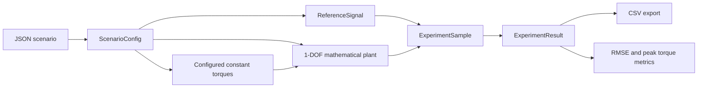
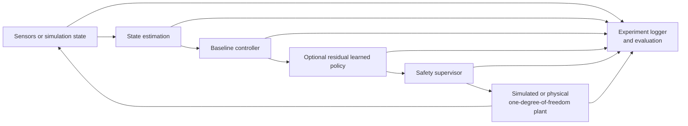

# Planned Architecture

This document describes the intended system decomposition. The deterministic
one-degree-of-freedom mathematical plant, deterministic open-loop experiment
framework, and foundation tooling listed under "Currently implemented" are
working software. State estimation, controllers, safety supervision, learning,
broader experiment tracking, external simulation, and hardware integration
remain planned.

## Implemented open-loop flow

This implemented path is deterministic and open loop. It contains no controller
or safety supervisor.

## System flow

The optional residual policy is intended to augment the baseline command. A
pass-through mode will allow classical controllers to use the same downstream
safety and evaluation path without a learned correction. The safety supervisor
owns the final command boundary; the learned policy does not bypass it.

## Planned modules

### Plant and sensing

The implemented scalar plant provides validated one-degree-of-freedom dynamics,
human, assistive, and disturbance torque inputs, and deterministic
semi-implicit Euler integration. It has no controller, joint-limit, or actuator
saturation decisions. Its API and limitations are documented in
[the model specification](one_dof_model.md).

External simulator and future physical-plant adapters remain planned. They may
expose a compatible plant-facing interface for comparison with the scalar
reference model. Planned sensor adapters will provide timestamped state data
without exposing hardware details to controllers.

### State estimation

State estimation will validate and transform measurements into a consistent
controller state. It may later include filtering, derivative estimation,
interaction-torque estimation, and explicit handling of stale or invalid data.

### Baseline controllers

Baseline controllers will share a typed interface and produce both a requested
torque and diagnostic data. The first planned implementations are an impedance
controller and a model-based controller.

### Residual learned policy

The optional learned policy will request a bounded residual torque based on a
defined observation. It will not directly actuate the plant. Training and
inference concerns will remain separate from the deterministic baseline and
safety paths.

### Safety supervisor

The supervisor will combine or filter requested torque, enforce configured
limits, detect invalid states and commands, select fallback behavior, and emit
structured intervention records. Its constraints must apply consistently in
training, simulation evaluation, and any future bench evaluation.

### Logging and evaluation

The implemented open-loop experiment layer records actual state, reference,
predefined torques, plant acceleration, scenario identity, and deterministic
execution metadata. It provides explicit standard-library CSV export plus
tracking RMSE and peak assistive torque outside controller logic.

State estimates, controller components, safety events, richer provenance,
additional metrics, and an experiment-tracking service remain planned.

## Currently implemented

The repository currently contains only:

- the typed `adaptive_assist` package and status-reporting module entry point;
- the validated deterministic 1-DOF mathematical plant and integration step;
- physical-behavior tests and a constant-torque mathematical demonstration;
- strict versioned JSON scenarios and analytic reference signals;
- deterministic open-loop execution, immutable records, optional CSV export,
  and initial controller-independent metrics;
- an open-loop experiment demonstration;
- packaging and development-tool configuration;
- a standard-library environment checker;
- continuous integration; and
- model, scope, architecture, and decision-record documentation.

There is no sensor interface, estimator, controller, policy, safety supervisor,
external simulator integration, ROS 2 integration, hardware interface, or
experiment-tracking service yet.

## Intended design boundaries

- Controllers should depend on typed state and reference interfaces, not on a
  particular simulator or hardware API.
- The safety supervisor should remain independently testable and independent of
  reinforcement-learning framework internals.
- Simulation and future physical adapters should implement a common plant-facing
  contract while keeping timing and transport details explicit.
- Experiment configuration and metric definitions should be version controlled.
- Training artifacts and large datasets should live outside the source tree and
  carry provenance that links them to code and configuration.

These boundaries are provisional and may change through documented Architecture
Decision Records.
