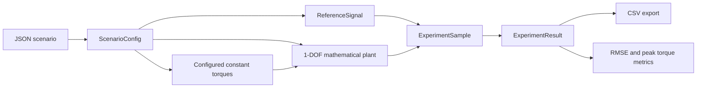
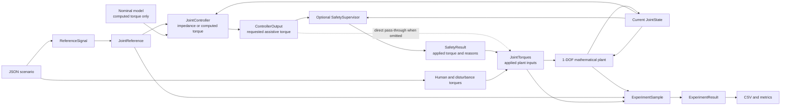
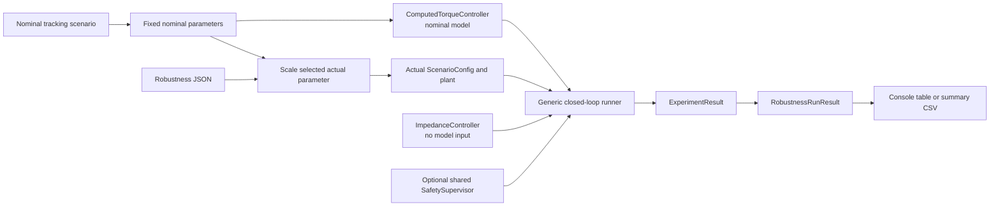
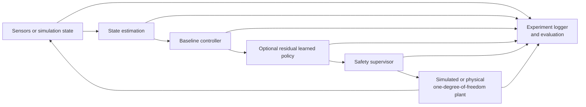

# Planned Architecture

This document describes the intended system decomposition. The deterministic
one-degree-of-freedom mathematical plant, deterministic experiment framework,
impedance controller, computed-torque controller, and foundation tooling listed
under "Currently implemented" are working software. A limited deterministic
safety supervisor for the scalar simulation is also implemented. State
estimation, MPC, learning, stochastic domain randomization, advanced safety
methods, broader experiment tracking, external simulation, and hardware
integration remain planned. A focused deterministic model-mismatch evaluation
layer is implemented outside those runtime components.

## Implemented open-loop flow

This implemented path is deterministic and open loop. It contains no controller
or safety supervisor.

## Implemented baseline-controller closed-loop flow

Both implemented controllers use this generic runner path. The computed-torque
controller owns a separate nominal model and reuses its public gravity and
passive-torque methods. With supervision enabled, requested and applied torque
are recorded separately. With supervision omitted, the runner explicitly marks
direct pass-through in metadata. Neither mode is a real-world safety claim.

## Implemented robustness-evaluation flow

The controller nodes indicate separate, equivalent-condition runs. The
evaluation layer constructs actual plant cases and summarizes existing
experiment results; it does not change dynamics, controller laws, supervision,
or fixed-step execution. Computed torque retains one fixed nominal model across
all cases, while impedance receives no model parameters.

## Planned full system flow

The optional residual policy is intended to augment the baseline command. A
pass-through mode will allow classical controllers to use the same downstream
safety and evaluation path without a learned correction. The safety supervisor
owns the final command boundary; the learned policy does not bypass it.

## Implemented and planned modules

### Plant and sensing

The implemented scalar plant provides validated one-degree-of-freedom dynamics,
human, assistive, and disturbance torque inputs, and deterministic
semi-implicit Euler integration. It has no controller, joint-limit, or actuator
saturation decisions. Its API and limitations are documented in
[the model specification](one_dof_model.md).

External simulator and future physical-plant adapters remain planned. They may
expose a compatible plant-facing interface for comparison with the scalar
reference model. Planned sensor adapters will provide timestamped state data
without exposing hardware details to controllers.

### State estimation

State estimation will validate and transform measurements into a consistent
controller state. It may later include filtering, derivative estimation,
interaction-torque estimation, and explicit handling of stale or invalid data.

### Baseline controllers

The implemented `JointController` interface maps state and reference to a typed
requested assistive torque. `ImpedanceController` implements proportional
position-error and derivative velocity-error feedback. `ComputedTorqueController`
implements the same protocol and adds nominal inertial feedforward plus gravity
and passive compensation through `OneDofJointModel`. Both have
version-controlled gains and contain no saturation or safety logic. MPC remains
planned.

### Residual learned policy

The optional learned policy will request a bounded residual torque based on a
defined observation. It will not directly actuate the plant. Training and
inference concerns will remain separate from the deterministic baseline and
safety paths.

### Safety supervisor

The implemented scalar-simulation supervisor checks finite requests and current
position/velocity, applies deterministic fallback, clips torque magnitude, and
emits ordered intervention reasons. It has one controller-independent interface
used by both baselines. Torque-rate limits, predictive constraints, advanced
fallback, and any external-simulator or physical integration remain planned.
The illustrative limits are not human, device, medical, or clinical thresholds.

### Logging and evaluation

The implemented experiment layer records actual state, reference, requested and
applied torque, intervention reasons, plant acceleration, scenario identity,
and deterministic execution metadata for open- and closed-loop runs. It
provides explicit standard-library CSV export, tracking and torque metrics, and
simulation-supervisor intervention metrics outside decision logic.

The implemented evaluation layer composes this API into deterministic
one-at-a-time actual-plant mismatch sweeps. It retains full `ExperimentResult`
objects, adds case identity and controller-independent summaries, and can write
an explicitly requested standard-library CSV. Domain randomization, uncertainty
modeling, and residual learning remain planned.

State estimates, richer controller components and safety events, additional
metrics and provenance, and an experiment-tracking service remain planned.

## Currently implemented

The repository currently contains only:

- the typed `adaptive_assist` package and status-reporting module entry point;
- the validated deterministic 1-DOF mathematical plant and integration step;
- physical-behavior tests and a constant-torque mathematical demonstration;
- strict versioned JSON scenarios and analytic reference signals;
- deterministic open-loop execution, immutable records, optional CSV export,
  and initial controller-independent metrics;
- an open-loop experiment demonstration;
- deterministic impedance and computed-torque controllers, strict gain
  configurations, a generic closed-loop runner, engineering demonstrations,
  and equivalent-condition baseline comparisons;
- a deterministic controller-independent simulation safety supervisor, strict
  limits configuration, requested/applied records, intervention metrics, and a
  supervised comparison;
- deterministic model-mismatch evaluation for both fixed-gain baselines, with
  separate actual and nominal parameters, one combined case, supervised and
  unsupervised modes, robustness summaries, tests, and optional CSV export;
- packaging and development-tool configuration;
- a standard-library environment checker;
- continuous integration; and
- model, scope, architecture, and decision-record documentation.

There is no sensor interface, estimator, MPC, learned policy, advanced or
real-world safety system, external simulator integration, ROS 2 integration,
hardware interface, or experiment-tracking service yet.

## Intended design boundaries

- Controllers should depend on typed state and reference interfaces, not on a
  particular simulator or hardware API.
- Controller-requested torque should remain distinct from the final applied
  torque boundary owned by safety supervision.
- The safety supervisor should remain independently testable and independent of
  reinforcement-learning framework internals.
- Simulation and future physical adapters should implement a common plant-facing
  contract while keeping timing and transport details explicit.
- Experiment configuration and metric definitions should be version controlled.
- Evaluation code may construct perturbed actual plants but must not expose
  those parameters to a controller's fixed nominal model or retune gains by
  case.
- Training artifacts and large datasets should live outside the source tree and
  carry provenance that links them to code and configuration.

These boundaries are provisional and may change through documented Architecture
Decision Records.
