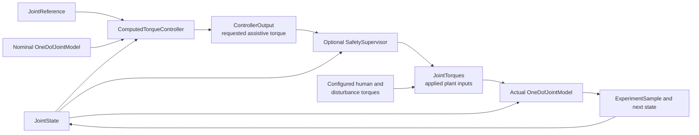

# Computed-Torque Controller Baseline

## Purpose and status

The implemented computed-torque controller is the project's first model-based
baseline. It combines the same proportional-derivative feedback used by the
impedance baseline with nominal inertial feedforward and compensation for the
plant's modeled gravity and passive torque. It is a deterministic engineering
simulation component, not MPC, a safety controller, or evidence of physical,
biomechanical, clinical, or medical validity.

## Controller equation

For current state `q, q_dot` and desired state
`q_ref, q_dot_ref, q_ddot_ref`:

```text
position_error = q_ref - q
velocity_error = q_dot_ref - q_dot

feedback_torque = Kp * position_error + Kd * velocity_error
inertial_feedforward = J_nominal * q_ddot_ref

requested_assistive_torque =
    inertial_feedforward
    + nominal_gravity_torque(q)
    + nominal_passive_torque(q, q_dot)
    + feedback_torque
```

The controller reads `J_nominal` from
`nominal_model.parameters.inertia_kg_m2`. It calls the public
`OneDofJointModel.gravity_torque_n_m()` and `passive_torque_n_m()` methods with
the current state. It does not duplicate the plant's gravity, damping, or
stiffness equations.

| Quantity | API name | Unit |
| --- | --- | --- |
| Position gain | `proportional_gain_n_m_per_rad` | N m/rad |
| Derivative gain | `derivative_gain_n_m_s_per_rad` | N m s/rad |
| Desired acceleration | `reference.angular_acceleration_rad_s2` | rad/s² |
| Requested torque | `requested_assistive_torque_n_m` | N m |

Positive position, velocity, and desired-acceleration terms follow the plant's
positive-torque sign convention.

## Nominal-model interpretation

If the controller model exactly matches the mathematical plant and human and
disturbance torques are zero, substituting the request into the plant equation
gives the intended continuous-time relationship:

```text
J * q_ddot ≈ J * q_ddot_ref
              + Kp * position_error
              + Kd * velocity_error
```

The approximation symbol acknowledges fixed-step numerical integration and the
fact that exact cancellation is only a property of the matching mathematical
model. The controller neither observes nor cancels human or disturbance torque;
the experiment runner adds those external inputs independently.

## Implemented architecture



`ComputedTorqueController` satisfies the existing `JointController` protocol,
so `run_closed_loop_experiment()` requires no computed-torque branch. The
actual plant and nominal controller model are immutable, separate objects. The
nominal demonstration gives them equal `JointParameters`; the implemented
robustness evaluation deliberately changes actual parameters while retaining
the controller's fixed nominal parameters without changing the runner or
controller interface.

## Configuration and gain rationale

`configs/controllers/computed_torque_baseline.json` contains only controller
identity, schema version, and feedback gains. Nominal dynamics parameters come
from the separately loaded scenario. The strict standard-library loader rejects
missing or unknown fields, unsupported types or versions, non-numeric values,
non-finite gains, and negative gains. Zero gains remain valid.

The initial gains match the impedance baseline:

```text
Kp = 20 N m/rad
Kd = 4 N m s/rad
```

Keeping the gains equal isolates the primary architectural difference:
computed torque adds nominal-model compensation and desired-acceleration
feedforward. The gains are demonstration values and were not retuned,
optimized, identified, or validated for a physical or biological system.

## Difference from impedance control and MPC

The impedance controller uses only position and velocity feedback. Computed
torque adds the nominal inertia, current-state gravity, and current-state
passive terms. This can reduce nominal tracking error when the model matches,
but it also introduces sensitivity to model error.

This controller is not model predictive control. It performs one algebraic
calculation per sample and has no optimizer, prediction horizon, constraints,
cost function, or future-input sequence. MPC remains unimplemented.

## Requested versus applied torque

The controller returns `ControllerOutput.requested_assistive_torque_n_m`. The
optional `SafetySupervisor` independently resolves the applied value before the
runner constructs `JointTorques`. Samples preserve the request, applied torque,
and intervention reasons. Without a supervisor, the explicit direct-pass-through
relationship is:

```text
requested assistive torque = applied assistive torque
```

With supervision enabled, the request may be clipped or replaced by fallback.
The controller and plant equations contain no safety policy. This mathematical
constraint layer provides no real-world safety guarantee; see
[the safety-supervisor guide](safety_supervisor.md).

## Sensitivity and limitations

Tracking and compensation can degrade when:

- nominal inertia differs from actual inertia;
- nominal mass or centre-of-mass distance is incorrect;
- nominal damping, stiffness, or rest angle is incorrect;
- unmodeled human torque is present; or
- disturbances act on the plant.

The controller also assumes exact, delay-free state and reference derivatives.
It has no integral action, estimator, adaptation, uncertainty model, actuator
model, saturation, constraint, filter, fallback, or safety termination. Its
nominal behavior does not establish robustness or suitability for a physical
system or person.

## Running the examples

```powershell
python scripts/run_computed_torque_experiment.py
python scripts/compare_baseline_controllers.py
```

The comparison uses one immutable scenario and equal feedback gains. Its
reported metrics describe only that deterministic mathematical scenario and
must not be interpreted as global controller rankings or validation evidence.
`python scripts/run_robustness_sweep.py` evaluates the same fixed gains under
the documented deterministic mismatch cases; see
[the robustness evaluation guide](robustness_evaluation.md).
