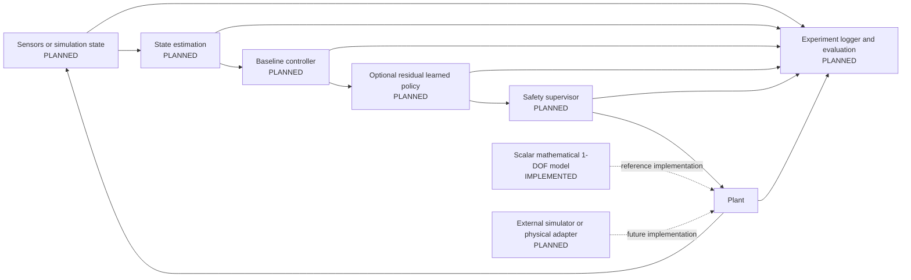

# Developer Reading Guide

This guide is a practical map of the repository as it exists today. The
implemented product code is a deterministic scalar one-degree-of-freedom
(1-DOF) joint model. Controllers, safety supervision, reinforcement learning,
ROS 2, external simulators, and hardware interfaces are planned, not
implemented.

## Repository organization

- `src/adaptive_assist/` contains the installable Python package. The dynamics
  implementation lives in `dynamics/joint.py`; the other package files expose
  its public API or support `python -m adaptive_assist`.
- `scripts/` contains runnable developer utilities: an environment check and a
  deterministic model demonstration.
- `tests/` covers package behavior and the physical behavior of the joint model.
- `docs/` separates the current model specification, broader project scope,
  planned architecture, and Architecture Decision Records (ADRs).
- `configs/` and `assets/` are documented placeholders; neither contains model
  configuration or runtime assets yet.
- `pyproject.toml` and `.github/workflows/ci.yml` define packaging and quality
  checks. The remaining root dotfiles provide editor, Git, and ignore rules.

## Recommended reading order

1. `README.md` — project status, motivation, current capabilities, and roadmap.
2. `docs/one_dof_model.md` — governing equation, units, sign convention,
   assumptions, integration method, and limitations.
3. `src/adaptive_assist/dynamics/joint.py` — the complete implemented model.
4. `tests/test_joint_dynamics.py` — executable examples of expected physical
   behavior, validation, determinism, and integration.
5. `scripts/run_free_joint_demo.py` — a small end-to-end use of the public API.
6. `src/adaptive_assist/__init__.py` and `dynamics/__init__.py` — public exports.
7. `docs/decisions/0001-simulator-independent-one-dof-model.md` — why this model
   is scalar, deterministic, standard-library-only, and simulator-independent.
8. `docs/project_scope.md` and `docs/architecture.md` — project boundaries and
   the explicitly planned future system.
9. `pyproject.toml`, `.github/workflows/ci.yml`, and `AGENTS.md` — development
   policy and automated checks.

## Current execution flows

### `python -m adaptive_assist`

1. Python resolves the installed `adaptive_assist` package.
2. `src/adaptive_assist/__main__.py` imports `main` from
   `src/adaptive_assist/main.py`.
3. `main()` prints `FOUNDATION_MESSAGE` and returns exit code `0`.
4. `__main__.py` raises `SystemExit` with that return code.

This command reports project status; it does not run the joint model.

### `python scripts/run_free_joint_demo.py`

1. The script imports the four public model types from `adaptive_assist`.
2. `main()` creates `JointParameters` and passes them to `OneDofJointModel`.
3. It creates the initial `JointState`, constant `JointTorques`, a fixed time
   step, and a duration.
4. Each loop iteration calls `angular_acceleration_rad_s2()` for display.
5. Except after the last row, it calls `step()` and replaces the local state
   with the returned `JointState`.
6. The script prints time, angle, velocity, and acceleration, then returns `0`.

The demo is a deterministic mathematical scenario, not a controller benchmark.

```mermaid
flowchart TD
    subgraph Status_command[Current: package status command]
        A[python -m adaptive_assist] --> B[adaptive_assist/__main__.py]
        B --> C[adaptive_assist.main.main]
        C --> D[Print FOUNDATION_MESSAGE and return 0]
    end

    subgraph Demo_command[Current: free-joint demonstration]
        E[run_free_joint_demo.py] --> F[Import public dynamics API]
        F --> G[Create parameters, model, state, and torques]
        G --> H[angular_acceleration_rad_s2]
        H --> I[Print current row]
        I --> J[OneDofJointModel.step]
        J --> K[New immutable JointState]
        K --> H
    end
```



## Current Python files

| Path | Responsibility |
| --- | --- |
| `src/adaptive_assist/__init__.py` | Defines `__version__` and re-exports the four primary model types at the package root. |
| `src/adaptive_assist/__main__.py` | Connects `python -m adaptive_assist` to `adaptive_assist.main.main()`. |
| `src/adaptive_assist/main.py` | Stores `FOUNDATION_MESSAGE` and implements the status-only `main()` function. |
| `src/adaptive_assist/dynamics/__init__.py` | Defines the public `adaptive_assist.dynamics` exports. |
| `src/adaptive_assist/dynamics/joint.py` | Defines validation, model dataclasses, torque calculations, angular acceleration, and semi-implicit Euler stepping. |
| `scripts/check_environment.py` | Uses the standard library to report environment details and required-file presence. |
| `scripts/run_free_joint_demo.py` | Runs and prints the current constant-assistive-torque demonstration through the public model API. |
| `tests/test_joint_dynamics.py` | Tests physical signs, torque composition, inertia response, validation, integration, determinism, and immutability. |
| `tests/test_package.py` | Tests package import/version and the module status entry point in a subprocess. |

`src/adaptive_assist/py.typed` is not Python code; it is the PEP 561 marker that
declares the installed package as typed.

## Model objects and their relationship

- `JointParameters` is immutable model configuration. It holds inertia, distal
  mass, centre-of-mass distance, gravity, damping, stiffness, and rest angle in
  SI units. Construction validates finite values and physical ranges.
- `JointState` is an immutable snapshot containing `angle_rad` and
  `angular_velocity_rad_s`.
- `JointTorques` is an immutable input bundle containing human, assistive, and
  disturbance torques in newton metres. Each defaults to zero.
- `OneDofJointModel` owns one `JointParameters` instance. Its calculation
  methods consume `JointState` and/or `JointTorques`; `step()` returns a new
  `JointState` rather than mutating the input.

```text
JointParameters ──constructs──> OneDofJointModel
JointState ────────────────────> calculations and step()
JointTorques ──────────────────> calculations and step()
OneDofJointModel.step() ───────> new JointState
```

## One simulation step

For `model.step(state, torques, time_step_s)`:

1. `_require_finite()` checks `time_step_s`; `step()` also requires it to be
   greater than zero.
2. `angular_acceleration_rad_s2(state, torques)` computes acceleration at the
   current state.
3. That method calls `total_applied_torque_n_m(torques)` to add the human,
   assistive, and disturbance inputs.
4. It calls `gravity_torque_n_m(state.angle_rad)` and
   `passive_torque_n_m(state)`, subtracts both terms from applied torque, and
   divides the result by `parameters.inertia_kg_m2`.
5. `step()` updates angular velocity with the current acceleration and explicit
   time step.
6. It updates angle using the **new** angular velocity. This ordering is the
   semi-implicit Euler method.
7. It constructs and returns a new validated `JointState`.

There is no joint-limit enforcement or torque saturation in this path.

## Where to make a change

| Change | Start here | Also check |
| --- | --- | --- |
| Physical parameter fields or validation | `src/adaptive_assist/dynamics/joint.py` → `JointParameters` | `docs/one_dof_model.md`, `tests/test_joint_dynamics.py` |
| Parameter values used by the demo | `scripts/run_free_joint_demo.py` | The printed scenario description |
| Gravity, passive, or net dynamics equations | `src/adaptive_assist/dynamics/joint.py` → torque methods and `angular_acceleration_rad_s2()` | Model documentation, ADR consequences, physical-behavior tests |
| Numerical integration | `src/adaptive_assist/dynamics/joint.py` → `step()` | Integration tests, model documentation, ADR 0001 |
| Demonstration scenario or output | `scripts/run_free_joint_demo.py` | `README.md` if invocation or meaning changes |
| Model and validation tests | `tests/test_joint_dynamics.py` | The behavior being changed in `joint.py` |
| Package or dynamics exports | `src/adaptive_assist/__init__.py`, `src/adaptive_assist/dynamics/__init__.py` | `__all__`, import tests, `py.typed` packaging |
| Status command | `src/adaptive_assist/main.py` and `__main__.py` | `tests/test_package.py` |
| Scope and implementation status | `README.md`, `docs/project_scope.md`, `docs/architecture.md` | `docs/one_dof_model.md`, ADRs |
| Packaging, Ruff, mypy, or pytest | `pyproject.toml` | `.github/workflows/ci.yml`, `AGENTS.md` |
| Continuous integration | `.github/workflows/ci.yml` | Corresponding local commands in `pyproject.toml` and `README.md` |
| Required-file environment checks | `scripts/check_environment.py` | Repository tree and new essential files |

The package has no canonical runtime parameter set outside the demo. Callers
must construct `JointParameters` explicitly.

## What to understand now

Read these closely before changing behavior:

- `src/adaptive_assist/dynamics/joint.py`;
- `tests/test_joint_dynamics.py`;
- `docs/one_dof_model.md`;
- `scripts/run_free_joint_demo.py`; and
- the package export files under `src/adaptive_assist/`.

These files can initially be treated as infrastructure or policy references:

- `pyproject.toml`, `.github/workflows/ci.yml`, and `.editorconfig` configure
  builds and quality checks;
- `.gitattributes` and `.gitignore` control repository hygiene;
- `scripts/check_environment.py` checks setup rather than model behavior;
- `assets/README.md` and `configs/README.md` reserve currently empty roles;
- `LICENSE` defines reuse terms; and
- `AGENTS.md` constrains automated coding sessions.

Do not ignore `docs/project_scope.md`, `docs/architecture.md`, or ADRs when a
change alters project boundaries or architectural decisions.

## Planned future architecture — not implemented

The following diagram summarizes the plan documented in
`docs/architecture.md`. Only the scalar mathematical plant exists today; every
other processing block shown here remains planned.



## Glossary

- **1-DOF:** One degree of freedom; here, one rotational joint coordinate.
- **Plant:** The physical or mathematical system whose motion responds to
  torque. The scalar mathematical plant is implemented.
- **State:** Current joint angle and angular velocity (`JointState`).
- **Applied torque:** Sum of human, assistive, and disturbance torque inputs.
- **Gravity torque:** The signed `m g l sin(q)` term that is subtracted in the
  equation of motion.
- **Passive torque:** Damping plus stiffness torque, also subtracted from
  applied torque.
- **Semi-implicit Euler:** Fixed-step integration that updates velocity before
  position.
- **Deterministic:** Identical parameters, inputs, initial state, and time step
  produce identical results.
- **Simulator-independent:** The model uses scalar standard-library Python and
  does not depend on an external physics engine.
- **ADR:** Architecture Decision Record; a durable explanation of a significant
  technical choice.

## Common commands

Run these from the repository root after activating the local virtual
environment:

```powershell
# Report package status
python -m adaptive_assist

# Run the deterministic mathematical demonstration
python scripts/run_free_joint_demo.py

# Run tests
python -m pytest

# Check and apply formatting
python -m ruff format --check .
python -m ruff format .

# Lint
python -m ruff check .

# Type-check
python -m mypy

# Check the local environment and essential files
python scripts/check_environment.py
```

## Reviewing future Codex-generated changes

- [ ] The change is small, focused, and within the requested milestone.
- [ ] Implemented and planned behavior are labelled accurately.
- [ ] New or changed Python behavior has type annotations and meaningful tests.
- [ ] Dynamics changes preserve explicit SI units and stated sign conventions.
- [ ] Invalid physical inputs raise useful errors rather than being clamped.
- [ ] `step()` behavior remains deterministic and input states are not mutated.
- [ ] Controller or safety decisions have not leaked into the plant model.
- [ ] Major dependencies are justified by an ADR before being added.
- [ ] Architecture, scope, model documentation, and exports match the code.
- [ ] No benchmark result, medical claim, or suitability for human use is
  implied without evidence.
- [ ] Ruff formatting, Ruff linting, mypy, pytest, and `git diff --check` pass.
- [ ] The final diff contains no unrelated files, generated artifacts, or
  secrets.

