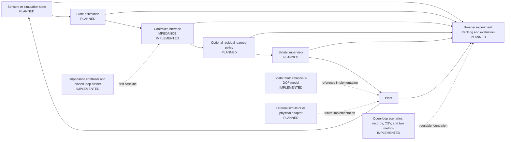

# Developer Reading Guide

This guide is a practical map of the repository as it exists today. The
implemented product code is a deterministic scalar one-degree-of-freedom
(1-DOF) joint model, reusable experiment interfaces, and a deterministic
impedance controller. Model-based control, safety supervision, reinforcement
learning, ROS 2, external simulators, and hardware interfaces remain planned.

## Repository organization

- `src/adaptive_assist/` contains the installable Python package. The dynamics
  implementation lives in `dynamics/joint.py`; `controllers/` contains the
  controller contract, impedance law, and gain loader; `experiments/` contains
  references, scenario loading, execution records, runners, logging, and metrics.
- `scripts/` contains an environment check, the original free-joint model demo,
  and the version-controlled open-loop experiment demo.
- `tests/` covers package behavior, plant physics, and experiment interfaces.
- `docs/` separates model and experiment specifications, broader project scope,
  planned architecture, and Architecture Decision Records (ADRs).
- `configs/scenarios/` contains strict version-controlled JSON scenarios;
  `configs/controllers/` contains the impedance baseline gains.
- `assets/` remains a documented placeholder for documentation media.
- `pyproject.toml` and `.github/workflows/ci.yml` define packaging and quality
  checks. The remaining root dotfiles provide editor, Git, and ignore rules.

## Recommended reading order

1. `README.md` — project status, motivation, current capabilities, and roadmap.
2. `docs/one_dof_model.md` — governing equation, units, sign convention,
   assumptions, integration method, and limitations.
3. `src/adaptive_assist/dynamics/joint.py` — the complete implemented model.
4. `tests/test_joint_dynamics.py` — executable examples of expected physical
   behavior, validation, determinism, and integration.
5. `docs/experiment_framework.md` — scenario schema, open-loop execution,
   records, CSV logging, metrics, and boundaries.
6. `src/adaptive_assist/experiments/` — the implemented experiment layer.
7. `tests/test_experiment_*.py` and `tests/test_scenario_config.py` — experiment
   behavior and failure cases.
8. `docs/impedance_controller.md` — feedback equation, gain units, closed-loop
   flow, requested/applied torque boundary, and limitations.
9. `src/adaptive_assist/controllers/impedance.py` and
   `tests/test_impedance_controller.py` — controller behavior and validation.
10. `src/adaptive_assist/experiments/runner.py` and
    `tests/test_closed_loop_runner.py` — where controller output enters the
    existing experiment loop.
11. `scripts/run_free_joint_demo.py`, `run_open_loop_experiment.py`,
    `run_impedance_experiment.py`, and `compare_open_loop_impedance.py` — small
    end-to-end uses of the public APIs.
12. Package and subpackage `__init__.py` files — public exports.
13. `docs/decisions/0001-simulator-independent-one-dof-model.md` — why the model
   is scalar, deterministic, standard-library-only, and simulator-independent.
14. `docs/decisions/0002-deterministic-experiment-framework.md` — why the first
    experiment layer uses typed records, JSON, CSV, and fixed steps.
15. `docs/decisions/0003-impedance-controller-baseline.md` — why requested
    torque, safety, and gain configuration are separate concerns.
16. `docs/project_scope.md` and `docs/architecture.md` — project boundaries and
   the explicitly planned future system.
17. `pyproject.toml`, `.github/workflows/ci.yml`, and `AGENTS.md` — development
   policy and automated checks.

## Current execution flows

### `python -m adaptive_assist`

1. Python resolves the installed `adaptive_assist` package.
2. `src/adaptive_assist/__main__.py` imports `main` from
   `src/adaptive_assist/main.py`.
3. `main()` prints `FOUNDATION_MESSAGE` and returns exit code `0`.
4. `__main__.py` raises `SystemExit` with that return code.

This command reports project status; it does not run the joint model.

### `python scripts/run_free_joint_demo.py`

1. The script imports the four public model types from `adaptive_assist`.
2. `main()` creates `JointParameters` and passes them to `OneDofJointModel`.
3. It creates the initial `JointState`, constant `JointTorques`, a fixed time
   step, and a duration.
4. Each loop iteration calls `angular_acceleration_rad_s2()` for display.
5. Except after the last row, it calls `step()` and replaces the local state
   with the returned `JointState`.
6. The script prints time, angle, velocity, and acceleration, then returns `0`.

The demo is a deterministic mathematical scenario, not a controller benchmark.

### `python scripts/run_open_loop_experiment.py`

1. The script resolves `configs/scenarios/nominal_open_loop.json` from the
   repository root and calls `load_scenario()`.
2. The loader strictly parses the JSON into `ScenarioConfig`, existing dynamics
   objects, and a `ReferenceSignal` implementation.
3. The script constructs `OneDofJointModel` from the scenario's parameters.
4. `run_open_loop_experiment()` evaluates the reference and predefined torques,
   records the plant response, and advances the plant at each fixed step.
5. The runner returns an immutable `ExperimentResult` with samples and
   deterministic metadata.
6. The script calculates `trajectory_tracking_rmse_rad()` and
   `peak_assistive_torque_n_m()` and prints a summary.
7. Only when `--csv PATH` is supplied does `write_experiment_csv()` create a
   file.

This command demonstrates open-loop infrastructure. It contains no controller
or safety supervisor.

### `python scripts/run_impedance_experiment.py`

1. The script loads `configs/scenarios/nominal_tracking.json` and the separate
   `configs/controllers/impedance_baseline.json` gain configuration.
2. It constructs `OneDofJointModel` and `ImpedanceController`.
3. `run_closed_loop_experiment()` evaluates the current `JointReference` and
   calls `ImpedanceController.compute(current_state, reference)`.
4. The runner copies the requested assistive torque into a `JointTorques`
   instance alongside configured human and disturbance torques.
5. The shared fixed-step loop records `ExperimentSample`, advances the plant,
   and returns `ExperimentResult`.
6. The existing controller-independent metrics produce the printed summary.

The direct requested-to-applied copy exists because no safety supervisor is
implemented. The output is an engineering simulation demonstration, not a
safety, biomechanical, or clinical benchmark.

### `python scripts/compare_open_loop_impedance.py`

1. `run_comparison()` loads the same tracking scenario and impedance gains.
2. It calls `run_open_loop_experiment()` and `run_closed_loop_experiment()` with
   separate stateless plant instances built from the same parameters.
3. Both runs share initial state, reference, human and disturbance torques,
   duration, and time step. Only assistive-torque generation differs.
4. `main()` prints tracking RMSE and peak assistive torque without making a
   performance or safety claim.

```mermaid
flowchart TD
    subgraph Status_command[Current: package status command]
        A[python -m adaptive_assist] --> B[adaptive_assist/__main__.py]
        B --> C[adaptive_assist.main.main]
        C --> D[Print FOUNDATION_MESSAGE and return 0]
    end

    subgraph Demo_command[Current: free-joint demonstration]
        E[run_free_joint_demo.py] --> F[Import public dynamics API]
        F --> G[Create parameters, model, state, and torques]
        G --> H[angular_acceleration_rad_s2]
        H --> I[Print current row]
        I --> J[OneDofJointModel.step]
        J --> K[New immutable JointState]
        K --> H
    end

    subgraph Experiment_command[Current: open-loop experiment]
        L[nominal_open_loop.json] --> M[load_scenario]
        M --> N[ScenarioConfig]
        N --> O[run_open_loop_experiment]
        O --> P[ExperimentResult]
        P --> Q[Metrics summary]
        P -. only with --csv .-> R[CSV file]
    end

    subgraph Closed_loop_command[Current: impedance experiment]
        S[nominal_tracking.json] --> T[ScenarioConfig]
        U[impedance_baseline.json] --> V[ImpedanceController]
        T --> W[run_closed_loop_experiment]
        V --> W
        W --> X[ExperimentResult]
        X --> Y[Metrics or comparison]
    end
```



## Current Python files

| Path | Responsibility |
| --- | --- |
| `src/adaptive_assist/__init__.py` | Defines `__version__` and re-exports the four primary model types at the package root. |
| `src/adaptive_assist/__main__.py` | Connects `python -m adaptive_assist` to `adaptive_assist.main.main()`. |
| `src/adaptive_assist/main.py` | Stores `FOUNDATION_MESSAGE` and implements the status-only `main()` function. |
| `src/adaptive_assist/dynamics/__init__.py` | Defines the public `adaptive_assist.dynamics` exports. |
| `src/adaptive_assist/dynamics/joint.py` | Defines validation, model dataclasses, torque calculations, angular acceleration, and semi-implicit Euler stepping. |
| `src/adaptive_assist/controllers/__init__.py` | Defines the public controller-layer exports. |
| `src/adaptive_assist/controllers/base.py` | Defines immutable `ControllerOutput` and the small `JointController` protocol. |
| `src/adaptive_assist/controllers/impedance.py` | Defines validated impedance gains and the proportional-derivative tracking law. |
| `src/adaptive_assist/controllers/impedance_config.py` | Strictly loads the versioned impedance gain JSON using the standard library. |
| `src/adaptive_assist/experiments/__init__.py` | Defines the public experiment-layer exports. |
| `src/adaptive_assist/experiments/reference.py` | Defines `JointReference`, the `ReferenceSignal` protocol, and constant and analytic sinusoidal signals. |
| `src/adaptive_assist/experiments/scenario.py` | Defines `ScenarioConfig`, strict schema validation, and the standard-library JSON loader. |
| `src/adaptive_assist/experiments/records.py` | Defines immutable experiment samples, deterministic metadata, and results. |
| `src/adaptive_assist/experiments/runner.py` | Executes open- or controller-driven torques through one shared fixed-step loop. |
| `src/adaptive_assist/experiments/logging.py` | Writes result samples to an explicitly requested CSV path. |
| `src/adaptive_assist/experiments/metrics.py` | Computes tracking RMSE and peak absolute assistive torque from a result. |
| `scripts/check_environment.py` | Uses the standard library to report environment details and required-file presence. |
| `scripts/run_free_joint_demo.py` | Runs and prints the current constant-assistive-torque demonstration through the public model API. |
| `scripts/run_open_loop_experiment.py` | Loads the nominal scenario, runs it, prints metrics, and optionally requests CSV export. |
| `scripts/run_impedance_experiment.py` | Loads tracking and gain configurations, runs impedance feedback, and prints metrics. |
| `scripts/compare_open_loop_impedance.py` | Runs open-loop and impedance assistance under equivalent scenario conditions. |
| `tests/test_joint_dynamics.py` | Tests physical signs, torque composition, inertia response, validation, integration, determinism, and immutability. |
| `tests/test_experiment_reference.py` | Tests constant and sinusoidal references, analytic kinematics, determinism, and invalid values. |
| `tests/test_scenario_config.py` | Tests nominal, malformed, invalid, and unsupported JSON scenarios. |
| `tests/test_experiment_runner.py` | Tests sample timing, deterministic execution, recorded torques, plant behavior, and immutability. |
| `tests/test_experiment_metrics.py` | Tests known RMSE and peak-torque cases plus explicit empty-result handling. |
| `tests/test_experiment_logging.py` | Tests CSV creation, headers, row count, and representative values in a temporary directory. |
| `tests/test_impedance_controller.py` | Tests controller signs, terms, zero/invalid gains, determinism, immutability, and unused acceleration. |
| `tests/test_impedance_config.py` | Tests strict gain configuration and invalid fields or values. |
| `tests/test_closed_loop_runner.py` | Tests controller call timing, torque composition, step count, determinism, and immutability. |
| `tests/test_controller_comparison.py` | Tests that shared comparison conditions differ only in assistive-torque generation. |
| `tests/test_package.py` | Tests package import/version and the module status entry point in a subprocess. |

`src/adaptive_assist/py.typed` is not Python code; it is the PEP 561 marker that
declares the installed package as typed.

## Model objects and their relationship

- `JointParameters` is immutable model configuration. It holds inertia, distal
  mass, centre-of-mass distance, gravity, damping, stiffness, and rest angle in
  SI units. Construction validates finite values and physical ranges.
- `JointState` is an immutable snapshot containing `angle_rad` and
  `angular_velocity_rad_s`.
- `JointTorques` is an immutable input bundle containing human, assistive, and
  disturbance torques in newton metres. Each defaults to zero.
- `OneDofJointModel` owns one `JointParameters` instance. Its calculation
  methods consume `JointState` and/or `JointTorques`; `step()` returns a new
  `JointState` rather than mutating the input.

```text
JointParameters ──constructs──> OneDofJointModel
JointState ────────────────────> calculations and step()
JointTorques ──────────────────> calculations and step()
OneDofJointModel.step() ───────> new JointState
```

The experiment layer composes those objects without changing their roles:

- `ScenarioConfig` owns initial state, plant parameters, a `ReferenceSignal`,
  fixed timing, and predefined `JointTorques`.
- `ExperimentSample` pairs one actual `JointState` with its `JointReference`,
  applied torques, time, and plant-computed acceleration.
- `ExperimentResult` holds the ordered immutable sample tuple and
  `ExperimentMetadata`.
- CSV and metric functions consume `ExperimentResult`; they do not call or
  modify the plant.

The controller layer connects through typed values rather than plant internals:

- `ImpedanceController.compute()` consumes the current `JointState` and
  `JointReference` and returns `ControllerOutput`.
- `run_closed_loop_experiment()` combines the requested assistive torque with
  configured human and disturbance torque in a new `JointTorques` value.
- That `JointTorques` is the currently applied plant input. A future safety
  supervisor will be inserted between `ControllerOutput` and this construction.

## One simulation step

For `model.step(state, torques, time_step_s)`:

1. `_require_finite()` checks `time_step_s`; `step()` also requires it to be
   greater than zero.
2. `angular_acceleration_rad_s2(state, torques)` computes acceleration at the
   current state.
3. That method calls `total_applied_torque_n_m(torques)` to add the human,
   assistive, and disturbance inputs.
4. It calls `gravity_torque_n_m(state.angle_rad)` and
   `passive_torque_n_m(state)`, subtracts both terms from applied torque, and
   divides the result by `parameters.inertia_kg_m2`.
5. `step()` updates angular velocity with the current acceleration and explicit
   time step.
6. It updates angle using the **new** angular velocity. This ordering is the
   semi-implicit Euler method.
7. It constructs and returns a new validated `JointState`.

There is no joint-limit enforcement or torque saturation in this path.

Within `run_open_loop_experiment()`, each experiment iteration first calls
`scenario.reference.evaluate(time_s)`, then
`model.angular_acceleration_rad_s2()`, constructs `ExperimentSample`, and calls
`model.step()` only if another timestamp remains. The final sample is recorded
at `duration_s` without stepping beyond the configured duration.

## Where to make a change

| Change | Start here | Also check |
| --- | --- | --- |
| Physical parameter fields or validation | `src/adaptive_assist/dynamics/joint.py` → `JointParameters` | `docs/one_dof_model.md`, `tests/test_joint_dynamics.py` |
| Parameter values used by the demo | `scripts/run_free_joint_demo.py` | The printed scenario description |
| Version-controlled experiment values | `configs/scenarios/*.json` | Schema in `docs/experiment_framework.md` and loader validation |
| Impedance gain values | `configs/controllers/impedance_baseline.json` | `impedance_config.py`, controller tests, and `docs/impedance_controller.md` |
| Impedance equation or gain validation | `src/adaptive_assist/controllers/impedance.py` | `tests/test_impedance_controller.py`, ADR 0003 |
| Reference behavior | `src/adaptive_assist/experiments/reference.py` | Reference tests and JSON reference schema |
| Gravity, passive, or net dynamics equations | `src/adaptive_assist/dynamics/joint.py` → torque methods and `angular_acceleration_rad_s2()` | Model documentation, ADR consequences, physical-behavior tests |
| Numerical integration | `src/adaptive_assist/dynamics/joint.py` → `step()` | Integration tests, model documentation, ADR 0001 |
| Demonstration scenario or output | `scripts/run_free_joint_demo.py` | `README.md` if invocation or meaning changes |
| Impedance demonstration or comparison output | `scripts/run_impedance_experiment.py`, `scripts/compare_open_loop_impedance.py` | Tracking scenario, gain configuration, comparison test |
| Open-loop execution order | `src/adaptive_assist/experiments/runner.py` | Runner tests, records, experiment documentation |
| Closed-loop torque connection | `src/adaptive_assist/experiments/runner.py` → `run_closed_loop_experiment()` | Closed-loop runner tests and safety-boundary documentation |
| Sample or metadata fields | `src/adaptive_assist/experiments/records.py` | Runner, CSV columns, metrics, tests |
| CSV schema | `src/adaptive_assist/experiments/logging.py` | Logging tests and experiment documentation |
| Controller-independent metrics | `src/adaptive_assist/experiments/metrics.py` | Metric tests and metric definitions in documentation |
| Model and validation tests | `tests/test_joint_dynamics.py` | The behavior being changed in `joint.py` |
| Package, dynamics, or experiment exports | Package and subpackage `__init__.py` files | `__all__`, import tests, `py.typed` packaging |
| Status command | `src/adaptive_assist/main.py` and `__main__.py` | `tests/test_package.py` |
| Scope and implementation status | `README.md`, `docs/project_scope.md`, `docs/architecture.md` | `docs/one_dof_model.md`, ADRs |
| Packaging, Ruff, mypy, or pytest | `pyproject.toml` | `.github/workflows/ci.yml`, `AGENTS.md` |
| Continuous integration | `.github/workflows/ci.yml` | Corresponding local commands in `pyproject.toml` and `README.md` |
| Required-file environment checks | `scripts/check_environment.py` | Repository tree and new essential files |

The package has no global default parameters. The nominal experiment values live
in version-controlled JSON; direct API callers must construct
`JointParameters` explicitly.

## What to understand now

Read these closely before changing behavior:

- `src/adaptive_assist/dynamics/joint.py`;
- `tests/test_joint_dynamics.py`;
- `docs/one_dof_model.md`;
- `src/adaptive_assist/experiments/`;
- `tests/test_experiment_*.py` and `tests/test_scenario_config.py`;
- `docs/experiment_framework.md`;
- `src/adaptive_assist/controllers/`;
- `tests/test_impedance_controller.py`, `tests/test_impedance_config.py`, and
  `tests/test_closed_loop_runner.py`;
- `docs/impedance_controller.md`;
- `configs/scenarios/nominal_open_loop.json`;
- `configs/scenarios/nominal_tracking.json` and
  `configs/controllers/impedance_baseline.json`;
- `scripts/run_free_joint_demo.py`; and
- `scripts/run_open_loop_experiment.py`.

These files can initially be treated as infrastructure or policy references:

- `pyproject.toml`, `.github/workflows/ci.yml`, and `.editorconfig` configure
  builds and quality checks;
- `.gitattributes` and `.gitignore` control repository hygiene;
- `scripts/check_environment.py` checks setup rather than model behavior;
- `assets/README.md` reserves a currently empty role;
- `configs/README.md` explains scenario ownership rather than runtime behavior;
- `LICENSE` defines reuse terms; and
- `AGENTS.md` constrains automated coding sessions.

Do not ignore `docs/project_scope.md`, `docs/architecture.md`, or ADRs when a
change alters project boundaries or architectural decisions.

## Planned future architecture

The following diagram summarizes the plan documented in
`docs/architecture.md`. The scalar mathematical plant, experiment framework,
and impedance controller exist today. State estimation, model-based control,
safety supervision, learned policies, external plant adapters, and broader
experiment tracking remain planned.



## Glossary

- **1-DOF:** One degree of freedom; here, one rotational joint coordinate.
- **Plant:** The physical or mathematical system whose motion responds to
  torque. The scalar mathematical plant is implemented.
- **State:** Current joint angle and angular velocity (`JointState`).
- **Reference:** Desired angle, angular velocity, and angular acceleration at a
  specified experiment time (`JointReference`).
- **Scenario:** Versioned fixed-step configuration for initial state, plant
  parameters, reference, and predefined open-loop torques (`ScenarioConfig`).
- **Sample:** One timestamped actual state, reference, torque bundle, and plant
  acceleration (`ExperimentSample`).
- **Result:** Ordered samples plus deterministic metadata (`ExperimentResult`).
- **Open loop:** Inputs are predefined and do not depend on measured state or
  tracking error; no controller is present.
- **Closed loop:** Assistive torque depends on the current state and reference
  through a controller.
- **Impedance controller:** The implemented proportional-derivative baseline
  that maps position and velocity error to requested assistive torque.
- **Requested torque:** The controller's output before future safety
  supervision (`ControllerOutput`).
- **Applied torque:** The `JointTorques` input passed to the plant. Requested and
  applied assistive torque are currently equal because no supervisor exists.
- **Total applied torque:** Sum of human, assistive, and disturbance plant
  inputs.
- **Gravity torque:** The signed `m g l sin(q)` term that is subtracted in the
  equation of motion.
- **Passive torque:** Damping plus stiffness torque, also subtracted from
  applied torque.
- **Semi-implicit Euler:** Fixed-step integration that updates velocity before
  position.
- **Deterministic:** Identical parameters, inputs, initial state, and time step
  produce identical results.
- **Simulator-independent:** The model uses scalar standard-library Python and
  does not depend on an external physics engine.
- **ADR:** Architecture Decision Record; a durable explanation of a significant
  technical choice.

## Common commands

Run these from the repository root after activating the local virtual
environment:

```powershell
# Report package status
python -m adaptive_assist

# Run the deterministic mathematical demonstration
python scripts/run_free_joint_demo.py

# Run the nominal open-loop infrastructure demonstration
python scripts/run_open_loop_experiment.py

# Run the closed-loop impedance engineering demonstration
python scripts/run_impedance_experiment.py

# Compare equivalent open-loop and impedance conditions
python scripts/compare_open_loop_impedance.py

# Export that experiment only when explicitly requested
python scripts/run_open_loop_experiment.py --csv output.csv

# Run tests
python -m pytest

# Check and apply formatting
python -m ruff format --check .
python -m ruff format .

# Lint
python -m ruff check .

# Type-check
python -m mypy

# Check the local environment and essential files
python scripts/check_environment.py
```

## Reviewing future Codex-generated changes

- [ ] The change is small, focused, and within the requested milestone.
- [ ] Implemented and planned behavior are labelled accurately.
- [ ] New or changed Python behavior has type annotations and meaningful tests.
- [ ] Dynamics changes preserve explicit SI units and stated sign conventions.
- [ ] Invalid physical inputs raise useful errors rather than being clamped.
- [ ] `step()` behavior remains deterministic and input states are not mutated.
- [ ] Controller or safety decisions have not leaked into the plant model.
- [ ] Controller output remains a requested torque; any future safety
  supervision is separate from the controller and plant.
- [ ] Controller comparisons preserve equivalent scenario conditions and do not
  overstate numerical results.
- [ ] Scenario files match the strict documented schema and contain no implicit
  randomness.
- [ ] Records, logging, and metrics remain controller-independent.
- [ ] Generated experiment outputs are not committed.
- [ ] Major dependencies are justified by an ADR before being added.
- [ ] Architecture, scope, model/experiment documentation, and exports match the
  code.
- [ ] No benchmark result, medical claim, or suitability for human use is
  implied without evidence.
- [ ] Ruff formatting, Ruff linting, mypy, pytest, and `git diff --check` pass.
- [ ] The final diff contains no unrelated files, generated artifacts, or
  secrets.

