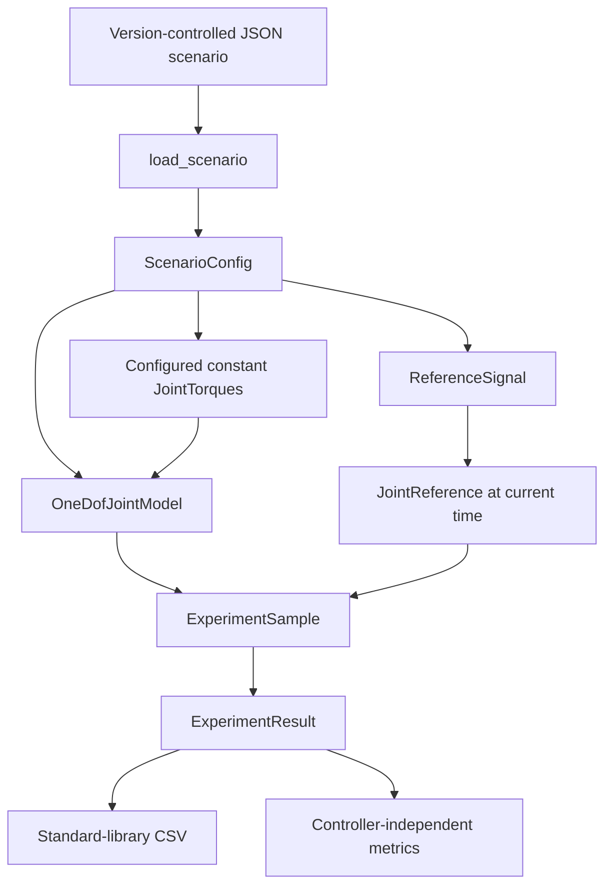

# Deterministic Experiment Framework

## Purpose and boundaries

The experiment layer runs reproducible open- and closed-loop scenarios against
the existing simulator-independent 1-DOF plant. It owns scenario parsing,
reference signals, fixed-step orchestration, immutable records, CSV export, and
metrics.

The boundaries are deliberate:

```text
Plant:                state + torques -> next state
Experiment framework: configuration + execution + records + metrics
Controller:           state + reference -> requested assistive torque
Safety supervisor:    not implemented
```

Open-loop experiments use all three configured torques directly. Closed-loop
experiments preserve configured human and disturbance torques while replacing
configured assistive torque with the selected `JointController` request. No
component filters actions, enforces joint limits, or saturates torque.

## Implemented open-loop flow



## Reference signals

`JointReference` stores desired angle, angular velocity, and angular
acceleration in SI units. All values are finite. A `ReferenceSignal` protocol
allows the runner to call `evaluate(time_s)` without depending on a specific
generator.

Two immutable implementations exist:

- `ConstantReference` always returns one fixed `JointReference`.
- `SinusoidalReference` analytically calculates angle, angular velocity, and
  angular acceleration from amplitude, frequency, offset, and time. It does not
  use numerical differentiation.

## Scenario configuration

`ScenarioConfig` contains the scenario name and schema version, duration, fixed
time step, initial `JointState`, `JointParameters`, one reference signal, and
constant `JointTorques`. Duration and time step must be finite and positive;
duration must be an integer multiple of the time step within a small
floating-point tolerance.

`load_scenario()` accepts the following strict JSON schema. Missing and unknown
fields, unsupported schema or reference types, invalid numbers, and existing
plant-parameter validation failures raise `ScenarioConfigError`.

```json
{
  "schema_version": 1,
  "scenario_name": "example",
  "duration_s": 1.0,
  "time_step_s": 0.01,
  "initial_state": {
    "angle_rad": 0.0,
    "angular_velocity_rad_s": 0.0
  },
  "joint_parameters": {
    "inertia_kg_m2": 1.2,
    "mass_kg": 2.5,
    "center_of_mass_distance_m": 0.25,
    "gravitational_acceleration_m_s2": 9.81,
    "damping_n_m_s_per_rad": 0.3,
    "stiffness_n_m_per_rad": 1.0,
    "rest_angle_rad": 0.0
  },
  "reference": {
    "type": "sinusoidal",
    "amplitude_rad": 0.2,
    "frequency_hz": 0.5,
    "offset_rad": 0.0
  },
  "torques": {
    "human_torque_n_m": 0.0,
    "assistive_torque_n_m": 1.0,
    "disturbance_torque_n_m": 0.0
  }
}
```

For a constant reference, replace the `reference` object with:

```json
{
  "type": "constant",
  "angle_rad": 0.0,
  "angular_velocity_rad_s": 0.0,
  "angular_acceleration_rad_s2": 0.0
}
```

The repository's nominal scenario is
`configs/scenarios/nominal_open_loop.json`.
Its numerical values are illustrative inputs chosen to exercise the deterministic
experiment pipeline. They are not identified biomechanical parameters, a model
of a particular person or device, or evidence of physical or medical validation.
`configs/scenarios/nominal_tracking.json` uses the same schema and provides two
sinusoidal cycles for the implemented baseline-controller demonstrations and
comparison.

## Fixed-step execution and records

`run_open_loop_experiment()` requires a `ScenarioConfig` and an
`OneDofJointModel` built from the same `JointParameters`. For each time from
zero through the configured duration, it:

1. evaluates the reference;
2. uses the configured constant torques;
3. asks `OneDofJointModel.angular_acceleration_rad_s2()` for acceleration;
4. creates an `ExperimentSample`; and
5. calls `OneDofJointModel.step()` when another sample is due.

A scenario with `N` integration steps produces `N + 1` samples, including the
initial state at `0` and final state at `duration_s`.

`run_closed_loop_experiment()` uses the same private sampling loop and timestamp
rules. At every sample it evaluates the reference, calls
`controller.compute(state, reference)`, constructs `JointTorques` from the
configured human/disturbance torques and requested assistive torque, then
records and advances the same public plant API. Controller evaluation also
occurs at the final recorded sample, but no integration follows that sample.

The controller's `ControllerOutput` is conceptually separate from the applied
`JointTorques`. They are numerically equal for assistive torque only because the
future safety-supervision layer does not exist yet. See the
[impedance controller guide](impedance_controller.md) and
[computed-torque controller guide](computed_torque_controller.md).

Each immutable `ExperimentSample` stores time, actual state, reference,
applied torques, and plant-computed acceleration. `ExperimentResult` stores the
scenario name, sample tuple, and deterministic `ExperimentMetadata`. Metadata
records schema version, integrator name, reference type, duration, time step,
and integration-step count. It deliberately contains no wall-clock timestamp or
random identifier.

## CSV logging

`write_experiment_csv()` writes one row per sample using Python's `csv` module.
Columns explicitly identify seconds, radians, radians per second, radians per
second squared, and newton metres. The function writes only to the path supplied
by the caller; normal experiment execution creates no output file.

The demonstration accepts `--csv PATH` for an explicit export. Tests write only
inside pytest temporary directories.

## Implemented metrics

Metrics are pure functions over `ExperimentResult`, outside plant and future
controller logic:

- `trajectory_tracking_rmse_rad()` computes root-mean-square actual-minus-
  reference angle error in radians.
- `peak_assistive_torque_n_m()` computes the largest absolute recorded
  assistive torque in newton metres.

Both reject an empty result with `ValueError`. Estimated human effort, actuator
energy, torque-rate smoothness, constraint violations, and robustness metrics
remain planned.

## Reproducibility

The framework uses no random values, timestamps, UUIDs, external simulator, or
global mutable state. Sample times derive from integer step indices rather than
repeated time accumulation. Immutable inputs and records prevent accidental
in-place changes. Both implemented controllers are stateless and deterministic.
With identical code, scenario and controller configuration, nominal model, and
Python environment, repeated runs produce equal `ExperimentResult` values.

## Controller and future safety connection

The implemented impedance and computed-torque controllers reuse the reference,
records, CSV writer, and metrics through `run_closed_loop_experiment()`. Their
shared use of the `JointController` protocol requires no controller-specific
runner branch. Future safety logic belongs between `ControllerOutput` and the
construction of applied `JointTorques`; it must not be embedded in the plant or
scenario loader.

## Limitations

- Open-loop torque inputs are constant and predefined; closed-loop execution is
  limited to the two implemented deterministic baseline controllers.
- Only constant and sinusoidal references are supported.
- Only JSON schema version 1 is supported.
- Execution is scalar and in memory; there is no streaming or batch runner.
- CSV contains samples but not a serialized metadata preamble.
- There is no experiment registry, artifact store, pandas integration, Hydra,
  MLflow, Weights & Biases, simulator-native logging, or ROS 2 transport.
- The framework provides no safety claims and is not suitable for human use.
