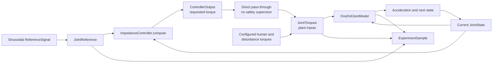

# Impedance Controller Baseline

## Purpose and status

The implemented impedance controller is the project's first deterministic
closed-loop baseline. It maps joint position and velocity tracking errors to a
requested assistive torque. It is an engineering simulation component, not a
safety controller, a biomechanically validated model, or a medical device.

## Controller equation

For actual state `q, q_dot` and reference `q_ref, q_dot_ref`, the controller
uses

```text
position_error = q_ref - q
velocity_error = q_dot_ref - q_dot

requested_assistive_torque = Kp * position_error + Kd * velocity_error
```

The API names and units are:

| Quantity | API name | Unit |
| --- | --- | --- |
| Position gain | `proportional_gain_n_m_per_rad` | N m/rad |
| Derivative gain | `derivative_gain_n_m_s_per_rad` | N m s/rad |
| Position error | `reference.angle_rad - state.angle_rad` | rad |
| Velocity error | `reference.angular_velocity_rad_s - state.angular_velocity_rad_s` | rad/s |
| Requested torque | `requested_assistive_torque_n_m` | N m |

Positive tracking error produces positive requested torque under the plant's
sign convention. Reference angular acceleration is deliberately unused by this
baseline.

## Implemented interfaces

- `JointController` defines `compute(state, reference) -> ControllerOutput`.
- `ControllerOutput` contains the finite requested assistive torque.
- `ImpedanceControllerParameters` contains immutable, finite, non-negative
  proportional and derivative gains. Zero gains are valid.
- `ImpedanceController` implements the equation above without saturation,
  filtering, internal state, or hidden defaults.

All input domain objects and outputs are immutable. Identical inputs and
parameters therefore produce identical outputs.

## Implemented closed-loop flow



`run_closed_loop_experiment()` evaluates the reference and controller once at
each recorded timestamp. It combines the requested assistive torque with the
scenario's human and disturbance torques, records the plant acceleration, and
steps the plant once unless the sample is final. As with open-loop execution,
`N` integration steps produce `N + 1` samples from exactly `t = 0` through
`duration_s`.

## Requested versus applied torque

The controller produces a request in `ControllerOutput`. The experiment runner
constructs the separate `JointTorques` plant input and records it as applied.
Because no safety supervisor exists, the current relationship is:

```text
requested assistive torque = applied assistive plant torque
```

This equality is temporary, not a safety guarantee. A future supervisor will
sit between `ControllerOutput` and `JointTorques`, where it may constrain or
replace the request and record the distinction. The dynamics model will not
need to change.

## Configuration and gain selection

The version-controlled baseline gains are in
`configs/controllers/impedance_baseline.json`. The strict standard-library
loader rejects missing or unknown fields, unsupported schema/controller types,
non-numeric values, non-finite gains, and negative gains.

The configured demonstration gains are:

```text
Kp = 20 N m/rad
Kd = 4 N m s/rad
```

They are simple engineering demonstration values, not optimized or identified
parameters. For the nominal tracking scenario, the small-angle gravity-plus-
passive stiffness is approximately `m*g*l + k = 7.13 N m/rad`. `Kp = 20`
provides a clearly observable corrective term above that nominal restoring
scale, while `Kd = 4` adds damping above the plant's `0.3 N m s/rad` passive
damping. A 0.01 s fixed step was then checked for bounded, qualitatively
correct tracking over two 0.5 Hz sinusoidal cycles. No gain search or claim of
optimality was made.

The scenario and gain values are not clinically, physically, or
biomechanically validated.

## Running the examples

```powershell
python scripts/run_impedance_experiment.py
python scripts/compare_open_loop_impedance.py
```

The comparison uses the same `nominal_tracking` scenario object for both runs.
Initial state, plant parameters, reference, human and disturbance torques,
duration, and time step are therefore equal. Only assistive-torque generation
differs: configured zero open-loop assistance versus impedance feedback. The
reported RMSE and peak torque are reproducible infrastructure outputs, not a
safety, biomechanical, or clinical benchmark.

## Assumptions and limitations

- Exact joint angle and velocity are available without estimation or delay.
- Gains remain constant throughout an experiment.
- The controller has no integral, model-based, feed-forward, or adaptive term.
- Reference acceleration is not used.
- There is no actuator model, saturation, torque-rate limit, command filter,
  joint limit, safety fallback, or unsafe-state termination.
- Demonstration results apply only to the scalar mathematical scenario and do
  not establish behavior on a physical system or with a person.
