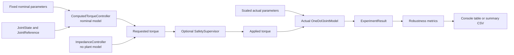

# Deterministic Model-Mismatch Robustness Evaluation

## Purpose and status

The implemented robustness layer evaluates the impedance and computed-torque
baselines when the actual scalar plant differs from the nominal parameters in
the tracking scenario. It uses deterministic engineering sweeps to expose
parameter sensitivity before any stochastic sampling or learned residual
policy is introduced.

The configured factors are illustrative test values. They are not identified
human variability, hardware tolerances, uncertainty bounds, safety evidence,
or physical validation.

## Actual plant versus nominal controller model

The central separation is:

```text
nominal_tracking.joint_parameters
        |
        +--> fixed computed-torque nominal OneDofJointModel
        |
        +--> scaled copy --> actual OneDofJointModel
```

For the nominal case, the two parameter values are equal, although the model
objects remain separate. For mismatch cases, `scale_joint_parameters()` creates
new validated actual parameters while the computed-torque controller retains
the original nominal model. The controller never receives the perturbed
parameters.

`ImpedanceController` follows the same `JointController` execution path but
does not own or receive a plant model. Its fixed gains apply in every case.



The controller nodes represent separate runs; impedance and computed torque
are never combined.

## Configuration and cases

`configs/robustness/model_mismatch_sweep.json` defines strict schema version 1,
repository-root-relative paths to the scenario, both controller configurations,
and safety limits, plus the default supervision mode and sweep cases.

The one-at-a-time sweep changes these actual-plant parameters:

| Parameter | API field | Factors |
| --- | --- | --- |
| Rotational inertia | `inertia_kg_m2` | 0.8, 1.0, 1.2 |
| Equivalent distal mass | `mass_kg` | 0.8, 1.0, 1.2 |
| Centre-of-mass distance | `center_of_mass_distance_m` | 0.8, 1.0, 1.2 |
| Viscous damping | `damping_n_m_s_per_rad` | 0.8, 1.0, 1.2 |
| Passive stiffness | `stiffness_n_m_per_rad` | 0.8, 1.0, 1.2 |

Gravitational acceleration and passive rest angle remain fixed. The nominal
experiment is executed once per controller and reused as the visible 1.0 row
for each parameter family.

The named `combined_moderate_mismatch` case applies these simultaneous factors:

```text
inertia:              1.20
mass:                 1.15
centre-of-mass:       0.90
damping:              1.20
stiffness:            0.85
```

These moderate values were selected before examining controller outcomes and
were not tuned to favor either baseline. Strict loading rejects malformed,
missing, unknown, duplicate, non-positive, or unsupported configuration data.
Derived parameters are constructed through `JointParameters`, preserving its
existing physical validation.

## Fairness invariants

For a corresponding case, both controllers use the same immutable actual
scenario: actual parameters, initial state, analytic reference, duration, time
step, human torque, and disturbance torque are identical. Both use the existing
20 N m/rad proportional and 4 N m s/rad derivative gains; the evaluation
rejects unequal feedback gains. When enabled, the same immutable `SafetyLimits`
and stateless `SafetySupervisor` apply to every run.

The intentional differences are controller law and the fixed nominal model
owned only by computed torque. Neither controller is retuned between cases.

## Execution and result structures

`run_robustness_sweep()` builds unique `RobustnessCase` values and composes the
existing `run_closed_loop_experiment()` API. Robustness behavior does not enter
the dynamics, controllers, supervisor, generic runner, or experiment records.

Each `RobustnessRunResult` retains its `ScenarioConfig`, existing
`ExperimentResult`, fixed controller parameters, optional safety limits, and
computed-torque nominal parameters where applicable. It adds only summary
metrics and case identity. `RobustnessSweepResult` preserves deterministic case
and controller ordering.

## Metrics

Every run reuses the existing controller-independent metrics:

- trajectory tracking RMSE;
- peak requested assistive torque;
- peak applied assistive torque;
- intervention count and sample fraction; and
- maximum requested-to-applied torque modification.

The robustness layer adds:

```text
rmse_degradation_fraction =
    (case_rmse - controller_nominal_rmse) / controller_nominal_rmse
```

Negative values mean lower RMSE than that controller's nominal run; they do not
imply global improvement. If nominal and case RMSE are both zero, degradation
is zero. A positive case RMSE with zero nominal RMSE produces infinity rather
than dividing silently. This is a descriptive deterministic ratio; it does not
quantify uncertainty.

`summarize_controller_robustness()` reports each controller's nominal RMSE and
the case with maximum RMSE. Because each controller has one fixed nominal
denominator, that same case also has its largest relative degradation.

## Supervised and unsupervised interpretation

The version-controlled default is supervised. This evaluates the complete
implemented command path and keeps one safety configuration fixed across all
cases. Torque clipping can make applied-torque peaks identical and can change
later feedback requests by changing plant evolution.

The `--unsupervised` option uses the generic runner's existing explicit
direct-pass-through mode. It exposes raw controller behavior and must be
interpreted separately as **controller robustness -- unsupervised**. Supervised
results are **safety-aware robustness -- supervised**. The script never mixes
the two modes in one result object or CSV.

The simulation supervisor and its limits provide no claim of real-world
safety.

## Running and CSV export

```powershell
python scripts/run_robustness_sweep.py
python scripts/run_robustness_sweep.py --unsupervised
python scripts/run_robustness_sweep.py --csv robustness_summary.csv
```

CSV is written only when `--csv PATH` is supplied. It contains one row for each
unique executed controller/case pair, deterministic ordering, summary metrics,
and the five varied actual parameter values. Generated outputs should not be
committed.

## Reproducibility and limitations

The sweep contains no random sampling, seeds, noise, domain randomization,
retuning, or timestamps. Identical code and configuration produce identical
summaries and CSV ordering.

This first evaluation is one scalar tracking scenario with one-at-a-time
0.8/1.0/1.2 factors and one combined case. It does not define uncertainty
distributions, coupled uncertainty surfaces, disturbance robustness, parameter
identification error ranges, or real-world behavior. The nominal
scenario has zero human and disturbance torque. The selected ranges are enough
to expose deterministic sensitivity in the current scenario but do not define
the uncertainty envelope for future learning.

Future work should justify broader deterministic cases or uncertainty models
before domain randomization. These results motivate a clearly specified
robustness problem for residual learning; they do not yet show that learning is
necessary, beneficial, or safe.
