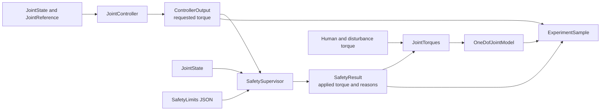

# Independent Simulation Safety Supervisor

## Purpose and status

The implemented `SafetySupervisor` is a deterministic command-constraint layer
for closed-loop experiments with the scalar mathematical plant. It resolves a
controller's requested assistive torque into the assistive torque passed to the
plant and records any intervention. It is independent of impedance and
computed-torque controller logic.

This layer is engineering simulation infrastructure. It does not make the
project safe for people, a medical device, clinically validated, or ready for
physical deployment.

## Implemented architecture



`run_closed_loop_experiment()` orchestrates this path. Both implemented
controllers use the same `JointController` and `SafetySupervisor` interfaces;
there is no controller-specific safety branch. The plant remains responsible
only for dynamics.

## Limits and configuration

Immutable `SafetyLimits` contains:

| Field | Meaning | Unit |
| --- | --- | --- |
| `max_abs_assistive_torque_n_m` | Symmetric requested-torque magnitude limit | N m |
| `min_joint_angle_rad` | Inclusive minimum permitted current angle | rad |
| `max_joint_angle_rad` | Inclusive maximum permitted current angle | rad |
| `max_abs_joint_velocity_rad_s` | Inclusive current velocity-magnitude limit | rad/s |
| `fallback_assistive_torque_n_m` | Replacement command for invalid requests or state violations | N m |

All values must be finite. Torque and velocity magnitudes must be non-negative,
the minimum angle must be below the maximum, and the fallback must lie within
the torque limit. Invalid configurations raise rather than being repaired.

`configs/safety/nominal_limits.json` uses a 2 N m assistive-torque limit,
angles from -0.5 through 0.5 rad, a 1.5 rad/s velocity-magnitude limit, and a
zero-torque fallback. These are illustrative engineering values selected to
make command clipping visible in the existing mathematical demonstration. They
are not human limits, device limits, clinical thresholds, or validated safety
limits.

The strict standard-library loader accepts exactly this schema:

```json
{
  "schema_version": 1,
  "max_abs_assistive_torque_n_m": 2.0,
  "min_joint_angle_rad": -0.5,
  "max_joint_angle_rad": 0.5,
  "max_abs_joint_velocity_rad_s": 1.5,
  "fallback_assistive_torque_n_m": 0.0
}
```

## Deterministic precedence and fallback

`SafetySupervisor.apply()` evaluates constraints in this order:

1. A non-finite requested command is replaced by the configured fallback and
   records `invalid_requested_command`. No lower-priority checks are reported.
2. A current angle outside the inclusive range and/or an absolute velocity
   above its limit causes fallback. Position is recorded before velocity when
   both are violated. Requested-torque clipping is not then evaluated.
3. A finite request whose magnitude exceeds the torque limit is symmetrically
   clipped and records `torque_limit`.
4. Otherwise the request passes unchanged with no intervention reason.

`ControllerOutput` preserves even a non-finite request so an active supervisor
can record and replace it. Unsupervised runner execution rejects such a request
explicitly before constructing plant-facing `JointTorques`. The fallback is
deliberately simple; this milestone contains no recovery controller.

## Requested and applied torque

- `requested_assistive_torque_n_m` is the upstream command before supervision.
  In a closed loop it is controller intent; in open loop it is the configured
  assistive command.
- `applied_torques.assistive_torque_n_m` is the resolved command supplied to
  `OneDofJointModel` for acceleration evaluation and, except at the final
  sample, state integration.
- `safety_intervention_reasons` records why the supervisor replaced or modified
  the request. `ExperimentSample.safety_intervened` derives from this tuple.
- `ExperimentMetadata.safety_supervision_active` distinguishes supervised runs
  from explicit direct-pass-through runs even when no intervention occurs.

When no supervisor is passed, `run_closed_loop_experiment()` preserves the
legacy deterministic behavior: requested and applied assistive torque are
equal, reasons are empty, and metadata marks supervision inactive.

## Final-sample convention

An experiment with `N` integration intervals still records `N + 1` samples.
At the final state, the runner evaluates the reference, controller, supervisor,
and plant acceleration so every sample has the same observation schema. It does
not call `OneDofJointModel.step()` afterward.

The final requested/applied values therefore describe an instantaneous command
resolution at `duration_s`; they are not torque applied over another interval
and must not be treated as additional energy or work. Intervention count,
fraction, peak commands, and maximum modification operate over all recorded
command evaluations, including this final sample.

## Logging and metrics

CSV export now writes separate
`requested_assistive_torque_n_m` and
`applied_assistive_torque_n_m` columns, plus `safety_intervened` and
`safety_intervention_reasons`. `safety_supervision_active` preserves run mode in
every CSV row, including runs with zero interventions. Multiple reasons use a
stable `|` separator.

Controller-independent metrics include:

- `safety_intervention_count()` over recorded samples;
- `safety_intervention_fraction()` as count divided by sample count;
- `maximum_torque_modification_n_m()` as the maximum absolute requested-minus-
  applied difference;
- `peak_requested_assistive_torque_n_m()`; and
- `peak_assistive_torque_n_m()`, which continues to mean peak **applied**
  assistive torque.

Every metric rejects an empty result. These values characterize simulation
command handling; they are not proof of safety. Peak request and maximum
modification return infinity if a recorded request was non-finite, rather than
allowing `NaN` to make aggregation order-dependent.

## Determinism and limitations

The supervisor is immutable, stateless, and uses no randomness, timestamps, or
hidden history. Identical limits, state, and request produce identical results.

This milestone does not implement torque-rate limiting, predictive state
constraints, control barrier functions, braking or actuator dynamics, thermal
limits, collision avoidance, watchdog timing, emergency-stop hardware, ROS
diagnostics, probabilistic methods, or clinical thresholds. Position and
velocity violations trigger a fixed torque fallback without proving that the
next state is feasible. No real-world safety validation has been performed.

## Running the demonstration

```powershell
python scripts/run_safety_supervisor_demo.py
python scripts/compare_baseline_controllers.py
python scripts/run_robustness_sweep.py
```

The first command intentionally exercises torque clipping. The comparison uses
one scenario and one limits file for both controllers, with and without
supervision, to show the effect of the independent command constraint.
The robustness sweep reuses the same illustrative limits for every supervised
parameter case and provides an explicitly separate `--unsupervised` mode.
